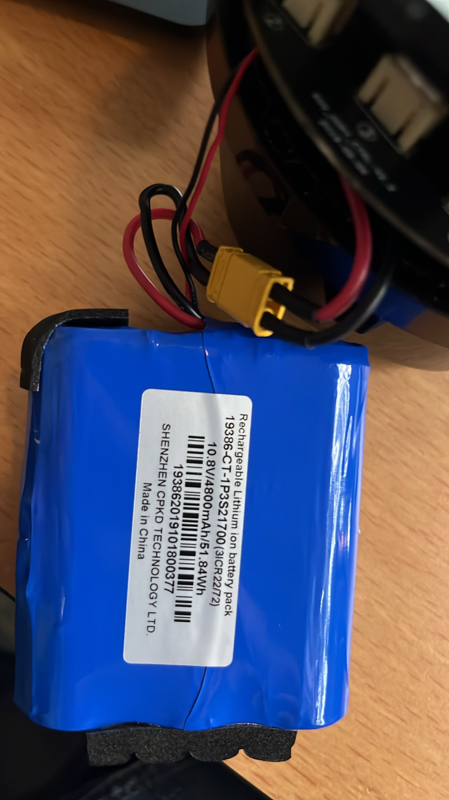
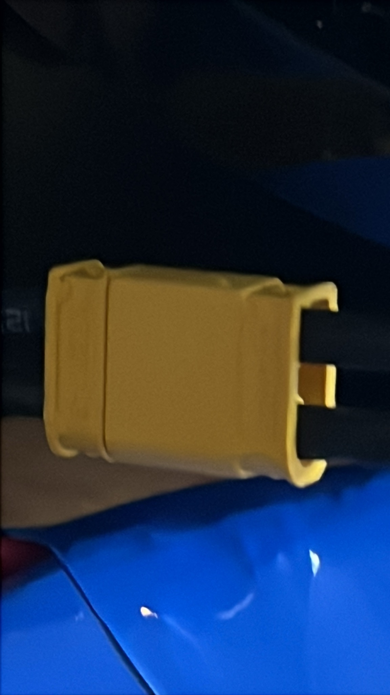

# Battery upgrade

Replace the cells in the **19386-CT-1P3S21700** pack. It is **1P3S**: three
cells in series, one parallel string, so a single cell carries the whole
current.

## What is printed on the pack



```
Rechargeable Lithium ion battery pack
19386-CT-1P3S21700  (3ICR22/72)
10.8V / 4800mAh / 51.84Wh
193862019101800377
SHENZHEN CPKD TECHNOLOGY LTD.
```

`3ICR22/72` is the IEC 61960 designation — **3** cells, **I**on, **C**obalt,
**R**ound, 22 mm max diameter × 72 mm max height. That confirms 3S 21700
independently of the marketing string.

Note the label says **4800 mAh** while the vehicle reports `BATT_CAPACITY`
3898 mAh. `BATT_CAPACITY` is a configured ArduSub parameter, not a measurement,
so the two do not have to agree — but 4800 mAh / 51.84 Wh are the pack's own
figures, and 51.84 Wh is the number that matters for shipping rules.

## The two cables

The pack leaves on **two** cables, and only one of them is power.

| cable | connector | carries |
|---|---|---|
| thick red + black | **XT30** (marked on the housing) | **all** the power — thrusters, lights, electronics |
| thin red + black | 2-way white JST next to the microSD socket | **I2C** — the pins are silkscreened `SCL` and `SDA` |



The second cable's red-and-black is just the cable the factory used; it carries
clock and data, not a supply. See `reference/board-sdcard.jpg` for the
connector and its silkscreen.

**There is no balance lead.** On a 3S pack that means charging and balancing
both happen through the XT30, so there is a **protection/BMS board inside the
pack** — most likely under the black tape along its top edge.

**Something on the pack speaks I2C**, which on a pack with a BMS and no balance
lead points at a fuel gauge reporting state of charge, cell voltages and
temperature digitally. Worth knowing that this is not fully pinned down: the
vehicle reports `BATT_MONITOR = 5`, ArduPilot's *analogue voltage and current*,
where a smart battery would normally be `7` or `11`. So either the STM32 reads
the gauge as a power manager while ArduSub measures the rail the analogue way,
or that bus carries something else entirely — a thermistor or an ID chip.

### What that means for a recell

The job is no longer "three cells and reuse the leads":

- the **BMS/gauge has to come across** with the new cells, or be replaced with
  one that speaks the same bus;
- a gauge left in place over new cells will keep reporting its **old learned
  capacity** until it is reset or relearns;
- a plain dumb pack with no I2C device may leave the drone unable to see its
  battery at all;
- **XT30 is rated around 15 A continuous**, which is a real ceiling to keep in
  mind alongside the cell choice if more powerful thrusters are ever fitted.

Every candidate must meet **all three** criteria — see "Why tabless" and "Why
this shortlist" below:

1. **tabless** construction
2. **unprotected** flat top
3. **more than the stock 4800 mAh**, from an established manufacturer

Two cells qualify:

| cell | capacity | continuous | pulse | maker |
|---|---|---|---|---|
| **Ampace JP50** | 5000 mAh | **60 A** | 180 A | Ampace, Xiamen (ATL/CATL joint venture) |
| **EVE 50PL** | 5000 mAh | 50 A | — | EVE Energy, Huizhou |

**`Ampace JP50` is the pick** — same capacity as the EVE, more continuous
current, and best-in-class pulse durability. The `EVE 50PL` is a straight
second source at 50 A if the JP50 is unavailable; EVE is one of the largest
cell makers in the world, so neither is a no-name wrap.

## What the drone says about it

From the parameter dump (`./scripts/DoryTest.sh --identify`):

| parameter | value |
|---|---|
| `BATT_CAPACITY` | 3898 mAh (the label says 4800 mAh — see above) |
| `FS_BATT_VOLTAGE` | 10.5 V low-voltage failsafe |
| `BATT_MONITOR` | 5 — voltage **and** current |
| observed | 12.37 V, consistent with a healthy 3S pack |

There are **two batteries** reported over MAVLink, not one:

| id | reading | almost certainly |
|---|---|---|
| 0 | 12.37 V, 3S | the drone's pack |
| 1 | 3.90 V, single cell | the buoy |

The firmware puts the whole pack voltage in the first cell slot rather than
reporting the three cells individually, so a single failing cell cannot be
spotted from telemetry.

## Why recelling is the only route

A replacement pack has to satisfy the I2C bus, and that turns out to rule out
almost everything.

**Nothing off the shelf has an I2C plug.** The closest physical matches are
hobby 3S 21700 packs with an XT30 — right chemistry, right cells, right
connector, and completely dumb. Packs with I2C or SMBus gauges are built
to order by pack houses (Cell-Con, Epec, Saphiion, CM Batteries, Hanery) with
minimum order quantities, not sold as single units.

**And a plug alone would not be enough.** The drone does not need *an* I2C
device, it needs *the* one — same chip, same bus address, same registers.
Anything else is silence or nonsense on that bus. There is also a reading that
cannot yet be ruled out: the device may be a **battery ID EEPROM** rather than a
gauge, which is exactly how vendors refuse third-party packs.

So there are three routes, and only one of them is cheap and certain:

| route | risk |
|---|---|
| **OEM pack**, Chasing `9A.10.100.0224` — also fits the E-reel and Minis, so supply is wider than Dory spares alone | none, but it is the stock 4800 mAh |
| **Recell, keeping the original BMS/gauge board** | none on the bus — the I2C device is preserved exactly |
| **Custom pack** | only possible once the chip is identified |

**Recelling is therefore the plan**, and the I2C finding is a positive reason
for it rather than a compromise.

### The measurement that would settle the bus

If it ever matters, two probe wires on `SCL`/`SDA` and a logic analyser name the
chip family from the address alone: `0x0B` is SMBus Smart Battery, `0x55` a TI
BQ-series gauge, `0x50`–`0x57` a 24Cxx EEPROM — an ID chip, not a gauge.

## Why tabless

A conventional cylindrical cell welds one or two small **tabs** to the wound
foil, and all the current from the whole electrode funnels through them. Current
from the far end of the spiral travels the entire length of the foil to reach
that tab, and all of it converges on one small spot — which is where the heat
appears.

Tabless leaves one foil edge uncoated, folds that **entire edge flat** and welds
it straight to the end cap. Every point on the electrode then has a short path
sideways to the collector instead of a long path along the roll.

| | effect |
|---|---|
| internal resistance | down 10–20% |
| heat | less of it, spread evenly rather than concentrated |
| hot spots | the tab hot spot — a classic thermal-runaway initiation site — does not exist |
| fast charge | 3C or better, against 1.5–2C conventional |

**This matters more here than in most applications.** A lithium fire inside a
sealed watertight hull is about the worst place for one, and in a 1P pack a
single cell carries the entire drone. Tabless attacks that at the root: less
heat generated, and no localised spot for a runaway to start.

Lower resistance also means less voltage sag, and the drone cuts out on
**voltage** (`FS_BATT_VOLTAGE` 10.5 V) rather than on charge counted — so a
low-resistance cell delivers more *usable* energy before the failsafe trips,
even at equal capacity.

**Tabless is an enabling architecture, not a guarantee.** Chemistry, electrode
loading and production consistency still dominate, and the word is starting to
appear on rewraps. That is the other half of why the brand list is short.

## Why this shortlist

Cell quality is a fire-safety decision, so the manufacturer has to have real
process control and a traceable datasheet. Country of origin is not the filter —
several of the largest and most rigorous cell makers are Chinese — but an
unknown wrap is disqualifying.

Applying the three criteria together is severe, and the cost is worth stating:

**It rules out 6000 mAh.** The handful of genuine 6000 mAh 21700s are neither
tabless nor from a tier-1 maker, and most cells advertised at that figure
deliver 4500–5000 mAh under load anyway. The shortlist therefore caps the pack
at **5000 mAh** — above the stock 4800 mAh, but only just.

It also rules out the tabless cells that sit *below* stock capacity, of which
there are several: a recell that reduces runtime is not an upgrade.

The trade is deliberate: **+4% capacity and 6x the current headroom** from a
known factory, rather than +25% from an unknown one.

## Fitment

**Physically and electrically a recell changes nothing.** A 5000 mAh 21700 is
still 21 x 70 mm, still Li-ion at 3.6 V nominal, still 3S. Same displacement
means
**the drone's trim and buoyancy are unchanged**, which on a submersible is not a
small thing. The BMS's voltage thresholds are chemistry-based and stay correct.

**Use unprotected flat-top cells.** The pack's own BMS does the protecting, and
a cell with its own protection PCB on the end runs 72–75 mm — the pack's IEC
designation `3ICR22/72` allows 72 mm, so a protected cell may simply not fit.

### The current rating is the thing to check, and it looks fine

In a 1P pack one cell carries the whole drone, so continuous discharge rating
matters more than capacity. Two pieces of evidence say the design draw is
modest:

- **The stock cells are already low-drain.** 4800 mAh in a 21700 puts it in the
  energy class, around **9.5–10 A continuous**. Chasing shipped that, so the
  peak cannot be far above it.
- **The connector agrees.** XT30 is good for roughly **15 A** continuous. A
  drone drawing 30 A would have shipped with XT60.

Against that, the shortlisted cells have enormous margin:

| cell | capacity | continuous | vs stock |
|---|---|---|---|
| stock | 4800 mAh | ~9.5–10 A | — |
| **Ampace JP50** | 5000 mAh | 60 A | **6x the current headroom** |
| EVE 50PL | 5000 mAh | 50 A | 5x |

Both are far beyond anything the XT30 could pass anyway, which is the point:
the cell will never be the limiting element, and it will run cool doing it.

### The one thing that will read wrong

`BATT_CAPACITY` is **3898 mAh** on the vehicle, and the percentage the app shows
is derived from it, not from the I2C device. Fit 5000 mAh cells and the drone
will still run to its **voltage** failsafe (`FS_BATT_VOLTAGE` 10.5 V) so no
charge is wasted — but the reported percentage will hit zero long before the
pack is empty.

The fix is to raise `BATT_CAPACITY` to match. That is a MAVLink `PARAM_SET`, and
`dorycontrol.py` currently only reads parameters, so it would need adding.

Charging also takes about 25% longer, which is only a problem if the stock
charger has a safety timeout.

## The number that decides the cell

The stock-cell and XT30 arguments above are inference. This is the measurement
that would replace them, and it is still outstanding.

Capacity and current normally pull in opposite directions in a 1P pack —
high-capacity 21700s are typically rated 8–10 A continuous while high-drain ones
manage 35–45 A. The shortlisted tabless cells largely dissolve that trade, which
is why the measurement is now a sanity check rather than a decision point.

So the peak draw decides it, and it has to be measured **in water** — a
propeller with nothing to push draws almost nothing. In air the whole drone
pulls about 1 A at full thrust, which says nothing useful.

```sh
sudo -v && ./scripts/DoryTest.sh --maxpower
```

Everything at full for 30 s, a reading every 5 s, then the peak. Note that
this firmware reports discharge as a **negative** current.
