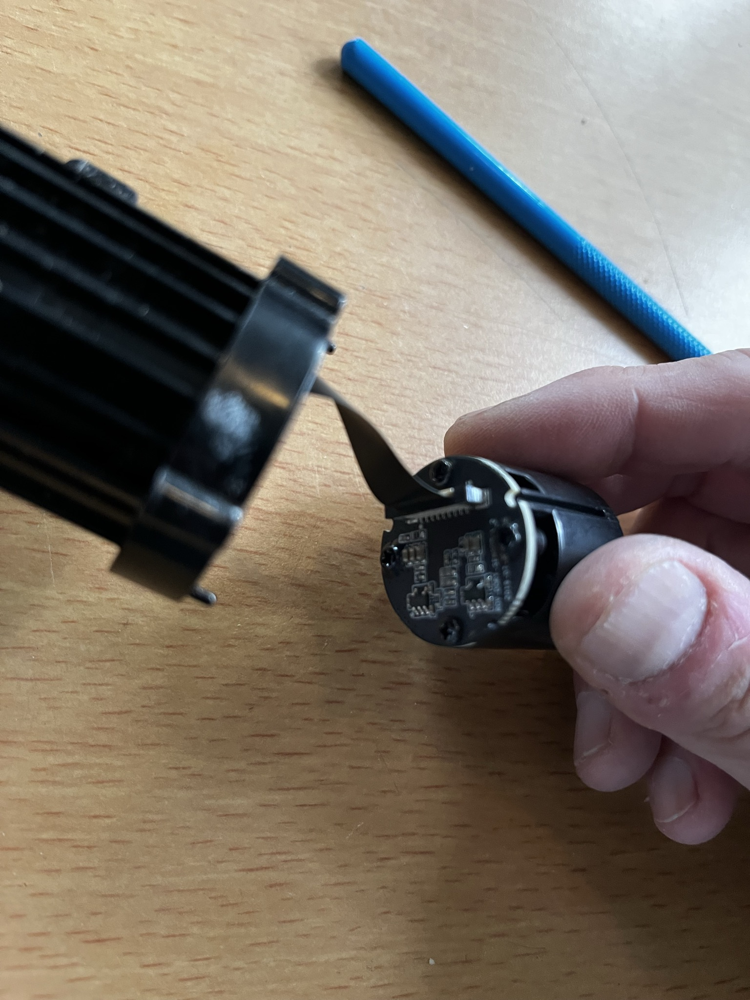

# Camera upgrade

Replace with a higher-resolution camera.

Standard is **1080p30 H.264 video and 1920×1080 stills**, 1/2.9" CMOS, f/1.6,
4 mm lens, 100° FOV, ISO 100–3200.

## Is 1080p the ceiling, or just the setting?

The vendor app's `CameraFeatureFps` bean has fields for **720P, 1080P and 4K**,
each with its own frame-rate list — so the app is at least written to handle a
camera that does more than this one is delivering. Whether this camera does is
a question for the device:

```sh
./scripts/DoryControl.sh --api
```

That reads `/v1/features` along with every other endpoint the app knows about.
If it lists only 1080P, that is the sensor's ceiling and no setting will raise
it. If it lists more, the resolution is configurable and worth exhausting
before opening anything.

## The module



A round PCB about a fingertip across, with a **flat flex ribbon (FFC)** leaving
the top edge and a handful of small ICs and passives on the back face — most
likely the regulators, since a sensor of this class typically wants three rails.
The barrel it sits in is finned black plastic. `camera-module-back.jpg` and
`camera-module-closeup.jpg` in `reference/` are the other two views.

The sensor itself faces the lens, inside the barrel, so **it appears in none of
these photos**. There is silkscreen along the right edge of the board that is
present but not resolvable at this distance.

Two measurements would move this on, and neither needs the barrel opened:

- the **FFC contact count and pitch** — 24 vs 30 pins is the difference between
  "any module with this cable" and "no"
- the **silkscreen part number**, with a macro shot

## A likely sensor, not a confirmed one

**The Sony IMX323LQN-C is a good fit for the published specs. It is not
confirmed, and nothing here should be built on as if it were.**

What lines up:

| stock camera | IMX323LQN-C |
|---|---|
| 1/2.9" CMOS | diagonal 6.23 mm, Type 1/2.9 |
| 1920×1080 stills | recommended recording pixels 1920 (H) × 1080 (V) |
| 1080p30 | HD1080p readout mode |
| ISO 100–3200 | CDS/PGA, 0–45 dB total gain |

1/2.9" is specific enough to narrow the field to roughly the **IMX322/IMX323**
pair — the neighbouring Sony parts often confused with them, IMX307 and IMX327,
are 1/2.8". That is a family match, not a serial number.

What does **not** line up: the datasheet recommends a lens of **F2.8 or more**,
and the stock lens is **f/1.6** — a good deal faster than Sony advises. Module
makers ignore that recommendation routinely, so it is a wrinkle rather than a
refutation, but it is the one specification that argues against.

**Why the identification is only a spec match.** Every figure above comes from
comparing published numbers, not from reading the part. Plenty of sensors were
built to hit 1/2.9" and 1080p30. Treat this as the first place to look, not as
an answer.

Three ways to actually settle it, cheapest first:

1. `./scripts/DoryControl.sh --api` — `/v1/features` is the firmware's own
   answer about what the camera can do, and costs nothing but a Wi-Fi switch.
2. The silkscreen on the module board, with a macro shot.
3. The sensor's own package marking, which needs the lens barrel off.

## If it is an IMX323, or anything like it

The consequence is worth understanding before any parts are ordered, because it
changes what this folder is trying to do. Two lines of that datasheet do the
damage:

> Readout mode: **HD1080 p mode / HD720 p mode**
>
> **CMOS logic parallel SDR Data-Clock output**

1. **Those are the only two modes.** No 4K, no intermediate resolution, nothing
   a register write unlocks. On that part 1080p30 is the ceiling of the silicon,
   and the `--api` check would come back saying so.
2. **It is a parallel (DVP) sensor, not MIPI.** Modern 4K sensors are MIPI
   CSI-2. Whatever receives parallel data behind that ribbon cannot clock in a
   MIPI stream, so this could not be a sensor swap on the same cable.

Which means, for any sensor of this generation, the upgrade is **not** "find a
higher-resolution module with the same flat cable". It is replacing the sensor,
the receiving ISP, and the H.264 encoder — the whole imaging chain.

There is a third constraint nobody has measured: even a 4K source has to
survive the tether and the buoy's Wi-Fi as RTP, and that link already drops out
at about 15 m.

## What the software side expects

The drone pushes **RTP/H.264 to UDP 5600, payload type 96**, and the script
hands that to VLC through an inline `sdp://` URL. Anything that changes the
codec, payload type or resolution changes that description — `--video` reports
the payload type it actually sees, so a swap is diagnosable rather than
silent.

The stream is not sent at all until the netcode handshake on UDP 40000 asks
for it, so any replacement has to sit behind the same relay or bypass it
entirely.
