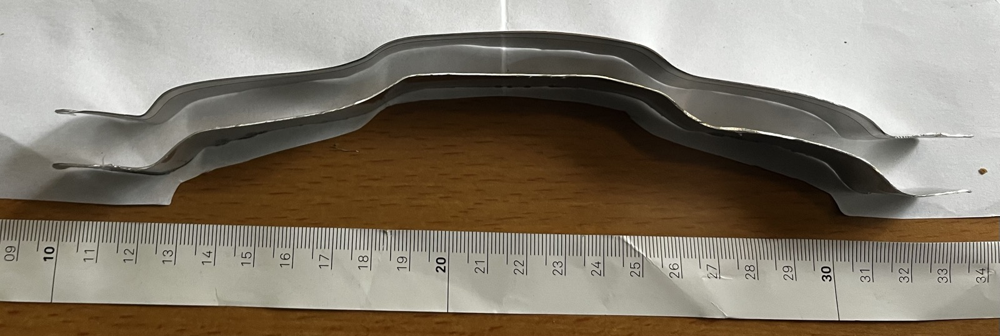
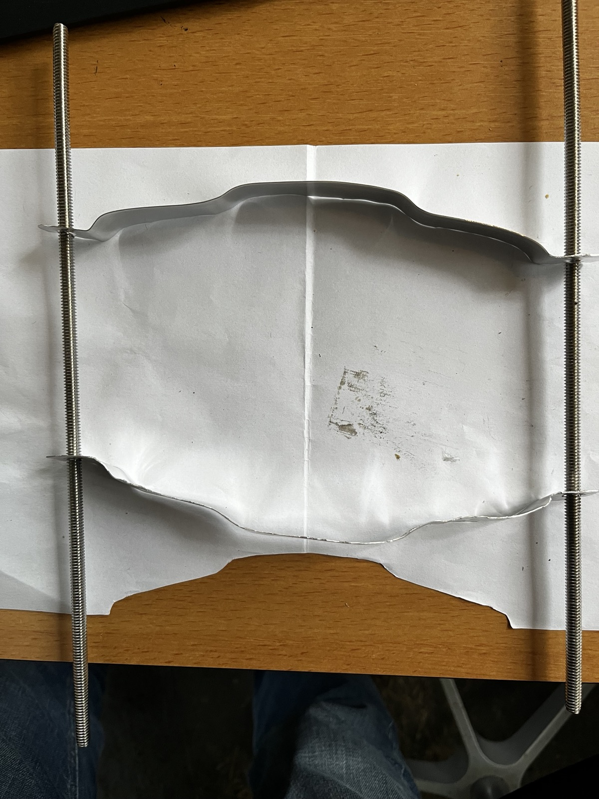
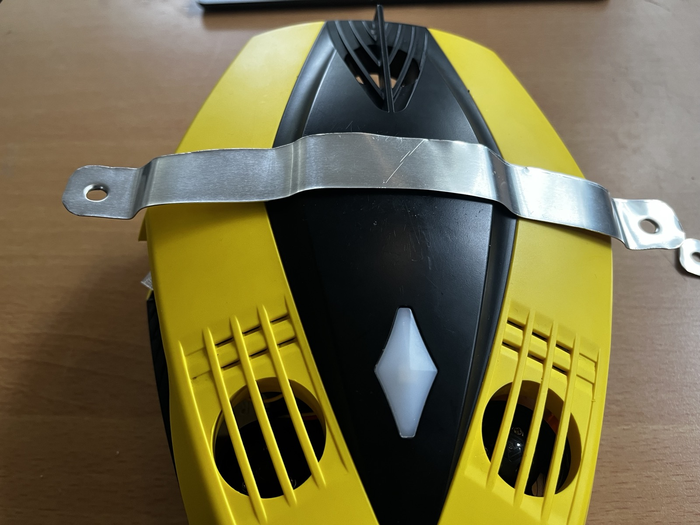

# Light rig

Two **Wurkkos DL07** diving lights on an aluminium arm, clamped to the hull.

## How it mounts

Rather than a printed ring, a **strap bent from thin aluminium** follows the
hull's top contour, with a flat tab at each end carrying a hole for a 1/4"-20
stud. A matching strap underneath and threaded rod down each side clamp the
hull between them; the lights then mount on the studs.

Clamping beats a printed negative of the hull: it tolerates measurement error,
and aluminium will not creep under load the way a printed part would.

**1. The contour to build against**, against a centimetre rule:

The profile runs from roughly the 9.5 cm to the 33.5 cm mark, so about
**240 mm of developed length** — more than the hull's 188 mm width, because the
strap follows the curve rather than crossing it. Read off the photo, so
approximate. The shape is a raised centre with a step down each shoulder, then
flat tabs.

**2. Where the threaded rods land**, template between them:

Two contours, top and bottom, with a rod at each side — the pair of straps and
the studs that join them.

**3. Trial fit in thin aluminium:**

Sitting behind the top thruster duct, tabs clear of the hull, holes ready for
the studs.

## What it must clear

From the callouts in the manual: the camera and LED lights on the front face,
the flash light on top, the drain and vent holes, and the thruster intakes. In
photo 3 the strap sits between the top duct and the two side ducts, which is
the gap available.

**Worth checking when it is tightened:** that the arm and lights do not shadow
the side thruster intakes. A partly shrouded duct loses thrust and can
cavitate.

## Still to do

- **1/4 inch female sockets in the hull** — the standard 1/4"-20 tripod thread,
  so anything off the shelf fits. A drilling and tapping job.
- Closed-cell PVC for buoyancy, to offset the added mass.
- Work out how far forward and outboard the lights must sit to keep
  backscatter out of frame. Tape them in place and watch `--video` before
  committing to hole positions.

Parts are in the main README's *Tools and parts*.
