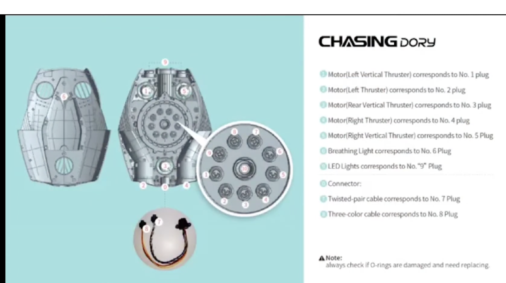

# PimpingDory

Two things live here:

1. **Software that talks to a [Chasing Dory](https://www.chasing.com) underwater
   drone without the vendor app** — download the media, watch the live camera,
   read telemetry, work the lights, drive the thrusters. No account, no login,
   no phone.
2. **A log of modifying the hardware** — a light rig, a bigger battery, more
   thrust, more storage, and a home-built metal detector. Some of it built, none
   of it finished, all of it written down.

Everything was worked out from the outside and tested on a real drone.
Not affiliated with or endorsed by Chasing.

## Hardware upgrades

Each one has its own folder with notes, photos and parts.

| upgrade | what | state |
|---|---|---|
| [**Light rig**](LightRig/) | two Wurkkos DL07 lights on an aluminium arm clamped to the hull | contour taken, aluminium strap trial-fitted |
| [**Metal detector**](MetalDetector/) | a self-contained pulse-induction pod that reports into the camera's view | plan, firmware and board done; nothing built |
| [**Battery**](BatteryUpgrade/) | recell the 1P3S 21700 pack | blocked on measuring peak current in water |
| [**Motors**](MotorUpgrade/) | more powerful thrusters | layout and drive understood, nothing ordered |
| [**Camera**](CameraUpgrade/) | higher resolution than the stock 1080p30 | not started |
| [**Storage**](StorageUpgrade/) | is the 16 GB an SD card, and can it be `dd`'d bigger | not started |

Further down: [what is inside the drone](#what-is-inside), [how to open
it](#opening-it), and [tools and parts](#tools-and-parts).

## The software

### Quick start

Join the drone's Wi-Fi — `Dory_xxxxx`, password `12345678` — then:

```sh
./scripts/DoryControl.sh --retrievemedia
```

Everything on the card lands in `./media`. On Windows the same options work
through `.\scripts\DoryControl.bat`.

```sh
./scripts/DoryControl.sh --list                       # what is on the card
./scripts/DoryControl.sh --retrievemedia ~/dive       # download somewhere else
./scripts/DoryControl.sh --retrievemedia --removemedia # download, then free the card
./scripts/DoryControl.sh --video                      # live picture in VLC
./scripts/DoryControl.sh --video ./dive.mp4           # watch and record at once
./scripts/DoryControl.sh --telemetry                  # depth, battery, heading
./scripts/DoryControl.sh --lights on                  # headlights, or off, or 1-100
./scripts/DoryControl.sh --control --power 30         # drive it from the keyboard
```

`--help` lists every option.

To keep the link open between commands, run `--daemon` and talk to it. The
daemon starts itself if it is not already running:

```sh
./scripts/DoryControl.sh --send arm
./scripts/DoryControl.sh --send "forward 2"
./scripts/DoryControl.sh --send status
./scripts/DoryControl.sh --send quit
```

### What you need

- **Python 3** and **curl**. macOS, Linux and Windows 10+ all work; Windows
  does not ship Python, so install it first.
- **VLC** for `--video`. It is found automatically. Without it the script
  serves the stream to a browser instead, which needs **ffmpeg**; with neither
  it says so and names both rather than failing obscurely.
- On **macOS**, anything that listens on a UDP port wants `sudo` — see the
  firewall note below. Nothing else needs it.

### What works, and what does not

| | state |
|---|---|
| list, download, resume, verified delete | works |
| live video in VLC | works |
| telemetry — depth, battery, voltage, heading | works |
| headlights, 1–100 | works |
| arming and driving every thruster axis | works |
| recording to a file alongside the live view | records; a playable file has not been confirmed |
| **which thruster each axis drives** | derived from the firmware, [not yet watched in water](#the-axis-mapping) |
| the Windows launcher | written, [never run on Windows](#windows) |

### Things that will bite you

**Nothing is pushed at you until you ask.** The buoy relays no video and no
telemetry until a client completes a handshake on UDP 40000, and the vehicle
itself has every telemetry stream rate set to zero. Bind a socket and wait and
you get nothing at all — that is not a fault, and it cost three trips to the
water to work out. The script does the handshake and asks for the streams
automatically; `--no-netcode` skips the handshake if you want to see the old
behaviour.

**On macOS the firewall silently eats inbound UDP.** Not "blocks with an
error" — the packets never reach the process. A packet capture showed 6843
video packets and 608 MAVLink packets arriving on the wire while the sockets
bound to those exact ports reported *silent*. So every mode that listens lowers
the firewall for the session and puts it back on exit, which is why those
modes want `sudo -v` first. Downloading never touches it. On Windows, allow
Python through the firewall prompt when it appears.

**Filenames are never percent-encoded.** The buoy does not decode them, so
`20260717_133442(1).mp4` sent as `…%281%29.mp4` comes back `500`. Five of 24
files failed this way before it was fixed.

**Expect dropouts.** The buoy's range is about 15 m. Downloads are checked
against the size the API reports and completed files are skipped, so re-running
after a dropout resumes rather than restarts.

**`--removemedia` never deletes a file it cannot prove you have.** With
`--retrievemedia` it downloads first, re-checks each file on disk against the
reported size, and only then issues the `DELETE`. Anything that failed to
download stays on the device. On its own it is deleting your only copy — add
`--confirm` and it demands a typed confirmation.

**`--debug` narrates every decision** — each request and reply, which host
answered, which response shape matched, the exact player command, the raw
telemetry before scaling. It goes to stderr, so `2>/dev/null` still leaves
clean output, and it all lands in `<path>/_run.txt` either way. That matters:
there is no internet on the buoy's Wi-Fi, so a bad trip has to be diagnosable
afterwards from the log alone.

### Driving it

`--control` takes the control role over REST, sends a 1 Hz heartbeat and RC
frames at 40 Hz, sets manual mode and arms. Arrow keys, `w`/`s`, `q`/`e`,
`r`/`f`; `a` to arm, space for neutral, `x` to quit. `--power N` sets how hard
it pushes.

**The vendor app has no failsafe at all** — on disconnect it stops sending and
that is that. This does the opposite: every key decays to neutral after 400 ms
unless repeated, and quitting sends twenty neutral frames followed by a disarm.

Try it in a bucket with the tether in hand before you try it over deep water.
The drone should not be run dry for long: the manual warns it can seize the
motors.

### Testing

`scripts/DoryTest.sh` exercises everything against the real drone and writes a
timestamped log meant to be read cold. Individual checks:

```sh
./scripts/DoryTest.sh --sweep      # drive every axis in turn, 8s each
./scripts/DoryTest.sh --identify   # what firmware, and every parameter
./scripts/DoryTest.sh --probe      # one arm, one movement, every byte logged
./scripts/DoryTest.sh --diagnose   # every theory at once, about 90s
```

The full suite, with no arguments, **ends by erasing the card**; `--keep`
skips the deletes.

### How it fits together

```
DoryControl.sh   ─┐
                  ├─→  scripts/dorycontrol.py    all the logic
DoryControl.bat  ─┘    (Windows goes via DoryControl.ps1)
```

The launchers do one job each: gather the network facts, export them, hand
over. Two hand-maintained implementations drift, and the drift only shows up
at the water where neither can be debugged.

---

## What is inside

### It runs ArduSub

`--identify` pulls all **588 parameters** off the vehicle. The underwater-only
ones settle what it is — they exist in no other ArduPilot build:

```
FS_LEAK_ENABLE    FS_PRESS_ENABLE   FS_TEMP_ENABLE
SURFACE_DEPTH     GND_SPEC_GRAV     MOT_1..8_DIRECTION
```

alongside eight core ArduPilot families (`AHRS_ ATC_ BRD_ COMPASS_ EK2_ INS_
RC1_ SR0_`). It reports **flight sw 1.1.6**, which is Chasing's own numbering
rather than ArduPilot's 3.x/4.x, and uses **`FRAME`, not `FRAME_CONFIG`** — an
older ArduSub, before that parameter was renamed.

Values worth knowing:

| parameter | value | meaning |
|---|---|---|
| `ARMING_CHECK` | 0 | **pre-arm checks disabled** — which is why it arms with no GPS and no calibration |
| `FS_GCS_ENABLE` | 2 | GCS-loss failsafe **active**, hence `MYGCS: 255, heartbeat lost` if the heartbeat stops |
| `FS_LEAK_ENABLE` | 0 | leak failsafe off |
| `SURFACE_DEPTH` | -10 | 10 cm counts as the surface |
| `BATT_MONITOR` | 5 | analogue voltage and current |
| `FRAME` | 1 | VECTORED thruster layout |
| `MOT_1..8_DIRECTION` | ±1 | eight thruster channels, though the drone has five |

**Keep the parameter dump.** It is the only record of how a given vehicle is
configured, and there is no way to recover it.

### The flight controller

**The board cannot be identified from software.** `AUTOPILOT_VERSION` returns
board, vendor and product ids all zero, and `BRD_SERIAL_NUM` is 0 too. Only
opening it would answer that.

What the parameters do establish:

- **Pixhawk-class hardware.** The `BRD_*` set — `BRD_PWM_COUNT`,
  `BRD_SER1_RTSCTS`, `BRD_SAFETYENABLE`, `BRD_CAN_ENABLE` — is the PX4/Pixhawk
  HAL, so that family or a clone of it, not an APM or a bespoke stack.
- **Six PWM outputs.** `BRD_PWM_COUNT = 6`, and of the aux channels only
  `RC6_FUNCTION = 56` is set, which is RCIN6 pass-through. So outputs **1–5 are
  the thrusters and output 6 is the light**, straight from RC channel 6.
- **Compass**: `COMPASS_DEV_ID = 68873` decodes to I²C bus 1, address `0x0D` —
  an HMC5883/QMC5883-class magnetometer, the commodity part.

### The ESCs

Nothing, and that is expected rather than a gap. `RC_SPEED = 490` is plain PWM
at 490 Hz; there is no `MOT_PWM_TYPE`, no `ESC_*` parameters and no ESC
telemetry. They are dumb output stages that take a pulse width and report
nothing back, so no protocol exists by which the firmware could know what they
are. No DShot or OneShot either — anything expecting RPM feedback or per-motor
current has nothing to talk to.

### The thrusters

The compute module's plug layout names every one:



| plug | goes to |
|---|---|
| **1** | Motor — Left Vertical Thruster |
| **2** | Motor — Left Thruster |
| **3** | Motor — Rear Vertical Thruster |
| **4** | Motor — Right Thruster |
| **5** | Motor — Right Vertical Thruster |
| **6** | Breathing Light |
| **7** | Connector — twisted-pair cable |
| **8** | Connector — three-colour cable |
| **9** | LED Lights |

> **Note:** always check if O-rings are damaged and need replacing.

**Two horizontal and three vertical, and no lateral thruster** — the drone
cannot strafe sideways. That is why RC channel 5 was free for Chasing to
repurpose as the lights: in stock ArduSub channel 5 is *lateral*, and this hull
has nothing to connect it to.

### The axis mapping

ArduSub's channel-to-axis mapping is fixed in the firmware, not configurable,
so knowing it is ArduSub gives the mapping:

| slot | axis | typed command | key | how the thrusters produce it |
|---|---|---|---|---|
| 4 | **forward / back** | `forward` `back` | ↑ ↓ | both horizontals together |
| 2 | **vertical** | `up` `down` | `w` `s` | all three verticals together |
| 3 | **yaw** | `left` `right` | ← → | the horizontals, differentially |
| 0 | roll | `rollleft` `rollright` | `q` `e` | left vertical against right |
| 1 | pitch | `pitchup` `pitchdown` | `r` `f` | the front verticals against the rear |
| 5 | *lateral* in stock ArduSub | — | — | **nothing — repurposed as the lights** |

Typed commands are named for what they do, so `--send "up 2"` ascends. The
arrow keys follow the joystick convention instead — pushing a stick away from
you is forwards — which is why ↑ is forward but `w` is up. Pitch is inverted
on the wire.

**Not yet confirmed in water.** The control path is proven — it arms, and a
sweep drives all ten inputs for eight seconds each with no dropout — but which
thruster each slot actually turns can only be seen, not logged.
`./scripts/DoryTest.sh --sweep` runs each in turn and announces it; in a
bucket, with the tether in hand.

### Dead ends, recorded so nobody retries them

- **The app** needs account registration, and login needs an internet
  connection the buoy's Wi-Fi does not have.
- **SSH.** Port 22 is open on the ROV but the daemon is ancient and modern
  OpenSSH refuses to negotiate. It connects with `-o
  KexAlgorithms=+diffie-hellman-group1-sha1 -o HostKeyAlgorithms=+ssh-rsa -o
  Ciphers=+aes128-cbc`, but the root password is unknown. Unnecessary anyway.
- `nmap` finds only 22 and 80 open.
- The manual documents **no** USB or computer transfer. App-only, officially.

### Reflashing it

**Unknown, untried, and not to be attempted without a recovery path.** An
underwater drone with no way back is a brick, and the vendor app is the only
official route.

Two of the four questions are answered: it reports `AUTOPILOT_VERSION` but
identifies no board, and all 588 parameters are readable and say ArduSub. What
remains: where the firmware physically lives — the flight controller is a
separate MCU behind the buoy's Linux box, so any reflash is likely *through*
it — and whether a stock build even targets this board. "Pixhawk-family" is
not a build target, and the thruster mapping and the light on output 6 are
Chasing's own and would be lost.

---

## The hardware itself

| | |
|---|---|
| **Drone** | 247 × 188 × 92 mm, 1.1 kg. Camera, 5 thrusters, 15 m max depth, ~60 min runtime. Tethered to the buoy; no Wi-Fi of its own |
| **Buoy** | 130 × 130 × 88 mm, 160 g. Floats, relays Wi-Fi, and **holds the 16 GB of media** — it is the thing to talk to |
| **Media** | JPEG 1920×1080 stills, MP4 H.264 1080p30 video |

### Opening it

The cover is held by **ST2.2 × 6.5** self-tapping screws — DIN 7983 TX, A4
stainless — so replacements are available off the shelf.

There is also **one Torx security screw**, needing a **T6H** bit (the
pin-in-Torx variant) **on a 50 mm shaft**. The shaft length is the part that
catches people out: a stubby bit will not reach it.

[This video](https://www.youtube.com/watch?v=_ONTOr11_d4) covers most of the
part replacements.

### Tools and parts

| what | for | where |
|---|---|---|
| **T6H bit set, 50 mm shaft** | the security screw — the long shaft is the point | [amazon.nl B0GXNLXH3R](https://www.amazon.nl/-/en/gp/product/B0GXNLXH3R/ref=ewc_pr_img_1) |
| **T6H screwdriver set** | the cover screws | [amazon.nl B0CZDN9Q1R](https://www.amazon.nl/dp/B0CZDN9Q1R?ref=ppx_yo2ov_dt_b_fed_asin_title) |
| **Connector release tool** | unplugging the wire connectors from the compute module | [amazon.nl B0FMR3Q7K2](https://www.amazon.nl/-/en/gp/product/B0FMR3Q7K2/ref=ewc_pr_img_1?th=1) |
| **ST2.2 × 6.5 screws**, DIN 7983 TX, A4 | replacing the cover screws | [rvspaleis.nl](https://www.rvspaleis.nl/plaatschroeven/din-7983-tx/din-7983tx-[-]-a4-[-]-2,2/7983-4-2.2x6.5tx_1) |
| **Flat aluminium profile**, 20 × 2 × 2000 mm | the light-rig arm | [gamma.nl B175328](https://www.gamma.nl/assortiment/profiel-plat-aluminium-brut-20x2x2000mm/p/B175328) |
| **1/4 inch thread adapters** | mounting the lights to the arm — standard 1/4"-20 tripod thread | [amazon.nl B0DCGCCXQC](https://www.amazon.nl/dp/B0DCGCCXQC?ref=ppx_yo2ov_dt_b_fed_asin_title) |
| **1/4"-20 nuts and washers**, 150 pc, 304 stainless | fastening the thread through a bottom and a top bar | [amazon.nl B0B1DZPQ1R](https://www.amazon.nl/-/en/dp/B0B1DZPQ1R) |
| **Wurkkos DL07 diving flashlight** ×2, 1 × 26650 each | the light rig | [wurkkos.com](https://wurkkos.com/products/wurkkos-dl07-diving-flashlight?VariantsId=12525) |

### 3D printed parts

| what | for | where |
|---|---|---|
| **Wifi Buoy Tether Loop** by rsoko | securing the buoy with a tether — clips on for a leash | [thingiverse thing:4031565](https://www.thingiverse.com/thing:4031565/files) |

---

## Still open

- **The axis mapping**, in water — see [above](#the-axis-mapping). One sweep in
  a bucket settles it.
- **Peak current under load.** The pack is 1P, so one cell carries everything,
  and that decides which 21700 can replace it. It has to be measured wet: in
  air a propeller with nothing to push draws almost nothing.
  See [`BatteryUpgrade/`](BatteryUpgrade/).
- <a id="windows"></a>**Windows.** `DoryControl.bat` → `DoryControl.ps1` →
  `dorycontrol.py`. The Python half is the code that works elsewhere, so the
  risk is concentrated in the launcher: the network facts and the argument
  parsing. `scripts/WINDOWS-NOTES.md` lists what is most likely wrong.
